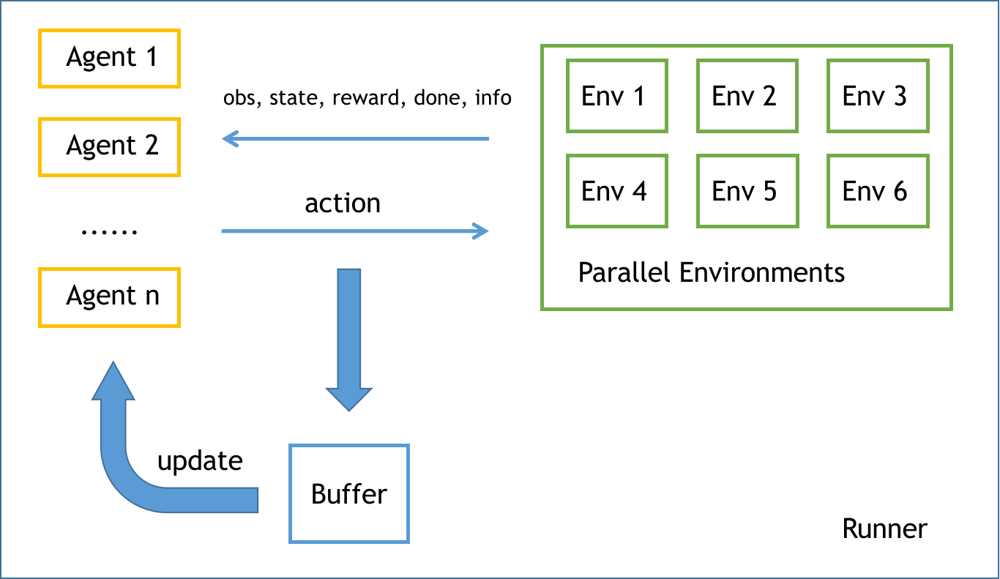
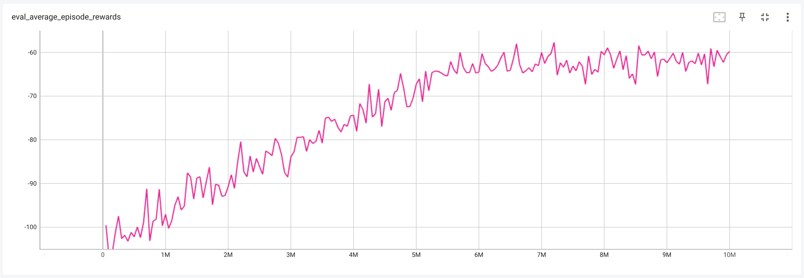

# MARL Demo Code

This is a demo code for training IPPO on Multiple-Particle-Environments (MPE).


## Installation

```bash
conda create -n marldemo python=3.7
conda activate marldemo
# install pytorch>=1.8.0 (CUDA>=11.0) manually
git clone https://github.com/Ivan-Zhong/MARLDemo.git
cd MARLDemo
pip install -e .
```


## Usage

```bash
cd examples
./train.sh
```


## Guidance

MARL pipeline is shown as follows:

<div align="center">
    
</div>


In this repo, there are two ways of instantiating parallel environments: for-loop (naively) and `multiprocessing`.


An environment is typically a class that implements the following interfaces:

```python
class ENV:
    def __init__(self, args):
        pass
    
    def step(self, action):
        """Execute the action and return information about the environment."""
        return obs, state, reward, done, info
    
    def reset(self):
        """Reset the environment."""
        return obs, state
    
    def seed(self, seed):
        """Seed the environment."""
        pass
    
    def render(self):
        """Render the environment."""
        pass
    
    def close(self):
        """Close the environment."""
        pass
```


## Training results

<div align="center">
    
    
</div>